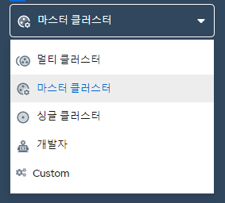
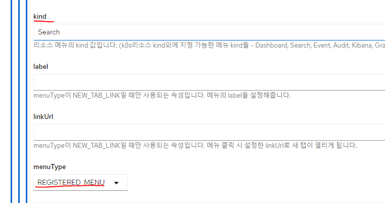
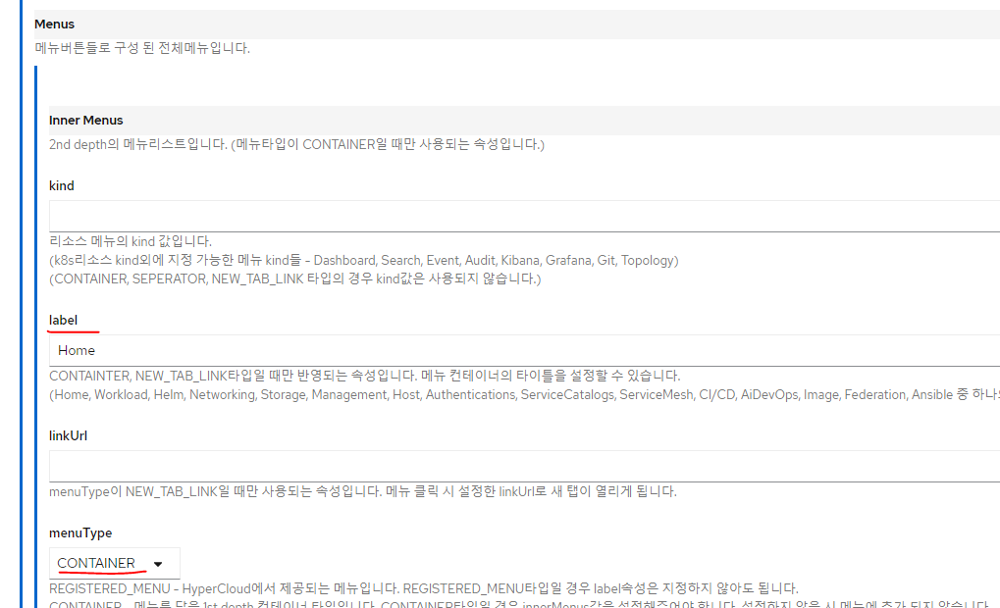

[< Home](/console/)

# 📘 Cluster Menu Policy 사용 가이드

## ClusterMenuPolicy란

CR 내용수정을 통해 클러스터 환경의 메뉴구성을 설정할 수 있는 리소스이다.

- [ClusterMenuPolicy CRD YAML](https://raw.githubusercontent.com/tmax-cloud/console/hc-dev-v5.1/docs/page-clustermenupolicy/yaml/ClusterMenuPolicy_CRD.yaml)
- [기본 메뉴구성 Sample YAML](https://raw.githubusercontent.com/tmax-cloud/console/hc-dev-v5.1/docs/page-clustermenupolicy/yaml/cmp-default-menus-sample.yaml)

## Spec 간단 설명

- **menuTabs** : 메뉴를 구성하는 큰 단위의 탭(perspective)이다. 'name'값으로 perspective 타입을 선택할 수 있다. perspective 하위 메뉴들은 'menus' 속성으로 지정해준다.
  
  - **menu** : 첫번째 depth의 메뉴를 정의할 수 있는 블럭이다. (각 속성설명에 대한 부분은 CRD의 description 참조)
    - **innerMenus** : 두번째 depth의 메뉴를 정의할 수 있는 블럭이다. (각 속성설명에 대한 부분은 CRD의 description 참조)
- **showCustomPerspective** : perspective 드롭다운에 custom 탭을 보여줄지에 대한 boolean 속성이다.

## 메뉴 추가 방법

### 하이퍼클라우드에 등록된 메뉴 추가 방법

- menuType은 REGISTERED_MENU로 설정하고, kind 값을 설정해준다. kind값으로 [kind로 설정 가능한 값들](#kind로-설정-가능한-값들) 목록에 있는 값을 설정해주어야 메뉴 타이틀에 번역이 적용되고, 정상적으로 뜬다.  
  

### 링크 메뉴 추가 방법

- menuType은 NEW_TAB_LINK로 설정하고, label(메뉴 타이틀)과 linkUrl(새 탭으로 열릴 링크 주소) 값을 설정해준다.  
   

### 컨테이너 메뉴로 감싸는 방법

- menuType은 CONTAINER로 설정하고, label(컨테이너 타이틀) 값을 설정해준다. 번역이 적용된 텍스트값을 사용하려면 [번역 적용되는 컨테이너 Text](#번역-적용되는-컨테이너-Text) 목록에 있는 text로 설정해주어야 한다. 컨테이너 안에 들어갈 메뉴들은 innerMenus 속성으로 지정해준다. (innerMenus의 메뉴추가방법은 위와 동일)
  

## kind로 설정 가능한 값들

### k8s 리소스 메뉴 kind

- Pod (파드)
- DaemonSet (데몬셋)
- HorizontalPodAutoscaler (HPA)
- ServiceAccount (서비스 어카운트)
- ReplicaSet (레플리카 셋)
- Deployment (디플로이먼트)
- Job (잡)
- Node (노드)
- Namespace (네임스페이스)
- Ingress (인그레스)
- ConfigMap (컨피그맵)
- Secret (시크릿)
- RoleBinding (롤바인딩)
- Role (롤)
- RoleBindingClaim (롤바인딩 클레임)
- PersistentVolume (영구 볼륨)
- PersistentVolumeClaim (영구 볼륨 클레임)
- StatefulSet (스테이트풀 셋)
- ResourceQuota (리소스 쿼타)
- NetworkPolicy (네트워크 정책)
- CustomResourceDefinition (사용자 리소스 정의)
- CronJob (크론 잡)
- StorageClass (스토리지 클래스)
- LimitRange (제한 범위)
- ClusterManager (클러스터) (멀티클러스터모드에서만 가능)
- SignerPolicy (서명자 정책)
- ImageReplicate (이미지 복제)
- PodSecurityPolicy (파드 보안 정책)
- FederatedConfigMap (페더레이션 - 컨피그 맵)
- FederatedDeployment (페더레이션 - 디플로이먼트)
- FederatedIngress (페더레이션 - 인그레스)
- FederatedJob (페더레이션 - 잡)
- FederatedNamespace (페더레이션 - 네임스페이스)
- FederatedReplicaSet (페더레이션 - 레플리카 셋)
- FederatedSecret (페더레이션 - 시크릿)
- FederatedService (페더레이션 - 서비스)
- FederatedPod (페더레이션 - 파드)
- FederatedHorizontalPodAutoscaler (페더레이션 - HPA)
- FederatedDaemonSet (페더레이션 - 데몬셋)
- FederatedStatefulSet (페더레이션 - 스테이트풀 셋)
- FederatedCronJob (페더레이션 - 크론 잡)
- Registry (컨테이너 레지스트리)
- ExternalRegistry (레지스트리 연동)
- ImageSigner (이미지 서명자)
- ImageSignRequest (이미지 서명 요청)
- ImageScanRequest (이미지 스캔 요청)

- Task (태스크)
- ClusterTask (클러스터 태스크)
- TaskRun (태스크런)
- Pipeline (파이프라인)
- PipelineRun (파이프라인 런)
- Approval (파이프라인 승인)
- PipelineResource (파이프라인 리소스)
- IntegrationJob (인테그레이션 잡)
- IntegrationConfig (인테그레이션 컨피그)
- VirtualMachine (가상머신)
- VirtualMachineInstance (가상머신 인스턴스)
- VirtualService (가상 서비스)
- DestinationRule (목적지 규칙)
- EnvoyFilter (엔보이 필터)
- Gateway (게이트웨이)
- Sidecar (사이드카)
- ServiceEntry (서비스 엔트리)
- RequestAuthentication (요청 인증)
- PeerAuthentication (피어 인증)
- AuthorizationPolicy (인가 정책)
- ServiceBroker (서비스 브로커)
- ServiceClass (서비스 클래스)
- ServicePlan (서비스 플랜)
- ClusterServiceBroker (클러스터 서비스 브로커)
- ClusterServiceClass (클러스터 서비스 클래스)
- ServiceInstance (서비스 인스턴스)
- ServiceBinding (서비스 바인딩)
- ClusterTemplateClaim (클러스터 템플릿 클레임)
- Template (템플릿)
- TemplateInstance (템플릿 인스턴스)
- ClusterTemplate (클러스터 템플릿)
- Notebook (노트북 서버)
- Experiment (하이퍼파라미터튜닝)
- TrainingJob (트레이닝 잡)
- InferenceService (추론 서비스)
- TrainedModel (학습 모델)
- TFApplyClaim (테라폼 클레임)
- AWX (AWX 인스턴스)
- Application (어플리케이션)
- NodeConfig(노드 컨피그)
- BareMetalHost (베어메탈 호스트)

### 그 외의 메뉴 kind

- Harbor (이미지 레지스트리)
- Topology (토폴로지)
- ClusterServiceVersion (설치된 오퍼레이터)
- OperatorHub (오퍼레이터 허브)
- Kiali (키알리)
- Add (Add)
- Git (관리 Gitlab)
- OpenSearch (오픈서치)
- ArgoCD (아르고씨디)
- Grafana (그라파나)
- Events (이벤트)
- Audit (감사 로그)
- Search (검색)
- Dashboard (개요)
- HelmChart (헬름 차트)
- HelmRelease (헬름 릴리스)

## 번역 적용되는 컨테이너 Text

#### (이 외의 text로 Container title값 설정하면 번역 없이 text 그대로 출력 됨)

- Home, Workload, Helm, Networking, Storage, Management, Host, Authentications, ServiceCatalogs, ServiceMesh, CI/CD, AiDevOps, Image, Federation, Ansible

## ClusterMenuPolicy CR 적용 방법

- 액션에서 '활성화'를 클릭 후 화면 새로고침 시 해당 CR이 클러스터환경에 적용되어 LNB구성에 내용이 반영된다.
  

[< Home](/console/)
